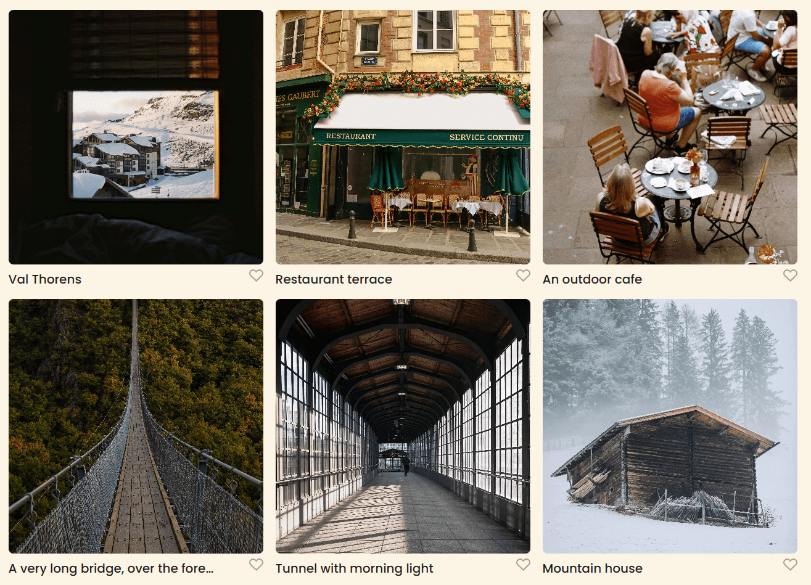

# Project 3: Spots

### Overview

Spots is a simple social media web interface built using HTML and CSS, following the BEM (Block Element Modifier) methodology for clean and maintainable code structure. The project utilizes Flexbox and CSS Grid for layout design.

**Features**

- Profile section to display user information with avator, name, and description.
- Profile section also provides the user a button to edit their profile information and add a new post.
- Uploaded photos will be displayed in a card layout.
- Page uses CSS Flexbox and gird to create a responsive design, page will adjust as the window shrinks.

**Technologies Used**

- HTML
- CSS
- BEM Methodology for CSS naming organization

**GitHub Pages**

- [Link to the project on GitHub](https://justinpot92.github.io/se_project_spots/)
- [Link to the recording of project](https://www.loom.com/share/e76d3dd6aa5145a9aa3e0edc63910dc5)

**Figma**

- [Link to the project on Figma](https://www.figma.com/file/BBNm2bC3lj8QQMHlnqRsga/Sprint-3-Project-%E2%80%94-Spots?type=design&node-id=2%3A60&mode=design&t=afgNFybdorZO6cQo-1)

**Images**

##### Header

##### Card Layout

##### Mobile View

